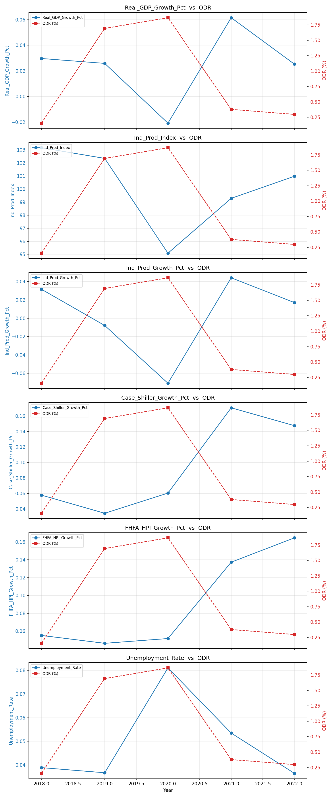
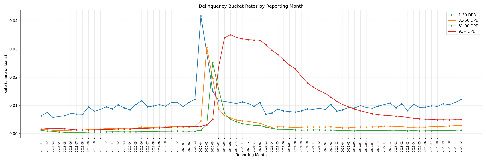
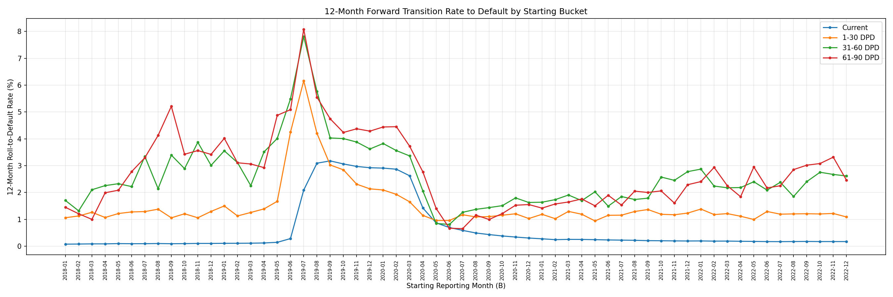

# Roll Rate Analysis — Freddie Mac Loan-Level Data

## Overview
12-month forward roll-rate (transition) analysis on the Freddie Mac Single-Family
Loan-Level dataset. The notebook tracks how loans move between delinquency
buckets over a 12-month horizon — i.e. of all loans that were Current (or
30/60/90 DPD) at month B, what share end up in default 12 months later — and
aggregates this into bucket-level transition rates, yearly trends, and a
macroeconomic correlation check against the resulting default rate (ODR).

## Visualizations (included)
Note: the images referenced below should be present in the repository root or
an `outputs/` directory; filenames used here match the notebook outputs.

- `selected_mev_vs_odr.png` — selected macroeconomic variables (growth/indices)
  plotted against yearly ODR to check correlation and sign consistency (image 1)

  

- `dpd_rate_trend.png` — monthly delinquency bucket rates (before transition)
  showing how 1-30, 31-60, 61-90 and 91+ DPD evolved across the sample window (image 2)

  

- `bucket_transition_trend.png` — 12-month forward roll-to-default rate by
  starting bucket (after transition). This is the core output for PD-term
  structure inference and provisioning work (image 3)

  

## Why roll rates
Roll-rate analysis is a foundational building block for credit risk and
provisioning work — both IFRS 9 (and its Indian equivalent, Ind AS 109) and
CECL ECL models, as well as Basel PD estimation. It gives a direct, empirical
read on how delinquency emerges and progresses through a portfolio over time,
independent of any modelling assumptions — useful both as a standalone
diagnostic and as an input into PD term-structure construction for expected
credit loss provisioning under either framework.

A static delinquency snapshot tells you the *current* state of stress in a
portfolio. A transition matrix tells you the *trajectory* — which is what
actually feeds into IFRS 9 / Ind AS 109 stage migration, PD term-structure
construction, and ECL provisioning.

## Dataset

### Source
Freddie Mac Single-Family Loan-Level Dataset, monthly performance panel.
Delinquency buckets used: Current, 1-30 DPD, 31-60 DPD, 61-90 DPD, 91+ DPD (default).

### Sample design
- Loans originated between 2015 and Jan 2018, all still active as of the
  January 2018 reporting month, tracked monthly through Dec 2023 — giving
  each loan a multi-year observation window to capture the full
  delinquency-to-default progression, including the COVID-19 forbearance period.
- Drawn as a stratified random sample of 100,000 loans by origination
  quarter (Hamilton remainder method), to preserve the relative vintage
  composition of the original population rather than skewing toward any
  single origination period.

## Methodology
1. Batch processing with checkpointing — the full performance panel is too
   large to load in memory, so it's processed in chunks via `pyarrow.parquet`
   batch iteration, with per-batch checkpoint/resume logic (parquet accumulator
   + progress file) to survive interruptions on long-running jobs.
2. Before-transition snapshot — month-by-month share of loans in each
   delinquency bucket, as a raw baseline diagnostic (no roll-rate logic
   applied yet — just checking what the data itself looks like).
3. 12-month forward transition — for each starting bucket, computes the
   12-month roll-to-default rate (numerator/denominator counts accumulated
   across all loan-month pairs 12 months apart).
4. Yearly aggregation — transition rates averaged by reporting year for
   trend analysis.
5. MEV correlation & selection — candidate macroeconomic variables (GDP,
   unemployment, HPI, credit growth, etc.) are tested against the yearly ODR
   series on both correlation strength (|r| > 0.50) and expected sign, to
   select variables for downstream PD scenario modeling.

## Findings (expanded)
### 1. Before transition — raw delinquency snapshot
- The `dpd_rate_trend.png` plot shows the COVID shock clearly: 1-30 DPD rose
  first in Apr–May 2020, followed by 31-60 and 61-90 buckets, and a later
  rise in 91+ DPD.
- Early-stage buckets spiked sharply and then retraced as many loans cured or
  entered forbearance; however, their levels stayed elevated for a period
  which sustained inflows into 91+ DPD even as the immediate shock faded.
- By 2022 the series broadly normalized but remained above the pre-2020
  trough in certain vintages — important when constructing TTC vs PIT PDs.

### 2. After transition — 12-month roll-to-default check
- The `bucket_transition_trend.png` chart shows that 12-month roll-to-default
  rates rise monotonically with starting delinquency severity. Loans starting
  Current have the lowest 12-month roll-to-default; 61-90 DPD and 31-60 DPD
  show much higher conversion rates.
- The 2020 spike in transitions (the COVID cascade) is visible across all
  buckets, with particularly large increases for 31-90 DPD starting points.
  This validates the transition-based approach for PD term-structure
  construction and highlights the importance of stress-period conditioning
  when estimating PIT behavior.

### 3. Macro variables vs yearly ODR (selection)
- `selected_mev_vs_odr.png` overlays several macro indicators (real GDP
  growth, industrial production, house-price growth indices, unemployment,
  etc.) with the yearly ODR series.
- The screening step in the notebook tests for correlation magnitude and
  expected sign; variables that pass are candidates for scenario-based
  mapping into PIT PDs.

## Output files
| File | Description |
|---|---|
| `dpd_rate_trend.png` | Delinquency bucket rates by reporting month (before transition) |
| `bucket_transition_trend.png` | 12-month roll-to-default rate by starting bucket (after transition) |
| `selected_mev_vs_odr.png` | Selected macro variables plotted against ODR |
| `roll_rate_12m_transition.parquet` | Full 12-month transition rate matrix |

## How to reproduce
1. Create a Python 3.8+ virtual environment and install requirements:

```bash
python -m venv .venv
source .venv/bin/activate
pip install -r requirements.txt
```

2. Place the Freddie Mac performance panel files (parquet) into `data/`
   (or point the notebook to your S3 / local path). Ensure the file naming
   and schema match the notebook expectations.

3. Run the notebook or the script that performs batch processing. For large
   datasets we recommend running on a machine with >= 16GB RAM and fast
   disk; the code uses parquet batch iteration and per-batch checkpointing to
   allow resumption on interruptions.

4. Outputs (plots + `roll_rate_12m_transition.parquet`) appear under `outputs/`.

## Suggested usage and interpretation
- Use the 12-month roll-to-default series by starting bucket as empirical
  anchors when building vintage- or bucket-based PD term-structures.
- For IFRS 9 / Ind AS 109 provisioning, map macro scenarios (baseline/
  optimistic/pessimistic) to the selected MEVs and then to PIT PDs using the
  correlation/selection logic shown in the notebook.
- Treat the COVID period as a stress scenario: blending TTC and PIT views is
  recommended for long-dated portfolios if the calibration window includes
  major structural shocks.

## Tech stack
Python, pandas, pyarrow (batch parquet processing), NumPy, SciPy, Matplotlib.

## Notes
Built as part of a broader ECL provisioning pipeline aligned with IFRS 9 /
Ind AS 109 principles — roll rates feed into PD term-structure construction
via Vasicek/ASRF TTC-to-PIT conversion (see related notebook/repo). Also
relevant to RBI's upcoming ECL-based provisioning framework (effective April
2027), which will replace the current IRAC norms for Indian banks and NBFCs.

## Contact
Open an issue or contact the repository owner for questions or requests for
exporting different figures or adding alternative macro indicators.

## License
Pick a license you prefer (MIT / Apache-2.0 / CC-BY). If none is present,
consider adding `LICENSE`.
