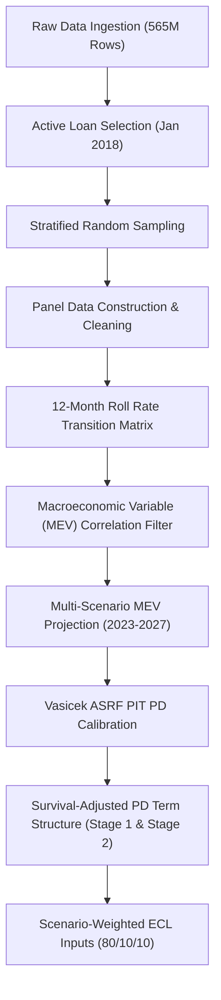

# Roll Rate Analysis and Point-in-Time (PIT) PD Term Structure Modeling

[](https://www.python.org/)
[](https://jupyter.org/)
[](https://en.wikipedia.org/wiki/Credit_risk)
[](https://www.ifrs.org/issued-standards/list-of-standards/ifrs-9-financial-instruments/)

An end-to-end Probability of Default (PD) modeling pipeline using 12-month forward roll-rate (transition) analysis on Freddie Mac single-family loan-level data. The notebook converts raw loan status histories into a macroeconomic-adjusted, forward-looking Point-in-Time (PIT) PD term structure suitable for IFRS 9 / Ind AS 109 Expected Credit Loss (ECL) provisioning.

---

## Table of Contents

- [Project Workflow](#project-workflow)
- [Data Ingestion & Sample Construction](#data-ingestion--sample-construction)
- [Data Cleaning, Imputation, & Limitations](#data-cleaning-imputation--limitations)
- [Delinquency Transition Matrix & Roll-Rate Analysis](#delinquency-transition-matrix--roll-rate-analysis)
- [Macroeconomic Overlay & MEV Selection](#macroeconomic-overlay--mev-selection)
- [Economic Scenarios & Vasicek ASRF](#economic-scenarios--vasicek-asrf)
- [Term Structure & Survival Analysis](#term-structure--survival-analysis)
- [Repository Structure](#repository-structure)
- [Getting Started](#getting-started)
- [Outputs & Limitations](#outputs--limitations)
- [References](#references)

---

## Project Workflow

The pipeline is organized into distinct phases:



---

## Data Ingestion & Sample Construction

The analysis uses two Freddie Mac files:
1. Origination (static borrower/loan attributes at inception).
2. Monthly performance (payments, DPD, foreclosure, loss metrics).

Key steps:
- Cohort: loans active as of January 2018.
- Stratified random sampling (by starting delinquency and FICO bands).
- Panel: monthly reporting from Jan 2018 through Dec 2023 (72 months).
- Pivot to wide format (loan ID per row, months as columns) — initial pivot produced ~17M unique loans.

To make processing tractable on commodity hardware, Parquet format (pyarrow) was used for efficient columnar access.

---

## Data Cleaning, Imputation, & Limitations

The raw panel contained `NR` (not reported) months. The textbook fix is rule-based interpolation (e.g., 1 → NR → 3 → interpolate 2), but row-by-row imputation over millions of loans exceeded the available RAM and CPU on a laptop. To avoid introducing complex imputation bias and to keep processing feasible, any loan with one or more missing months was dropped.

Result: a final, clean panel of ~1.3 million loans with uninterrupted 72-month histories.

---

## Delinquency Transition Matrix & Roll-Rate Analysis

States (based on Days Past Due):
- 0: Current
- 1: 1–30 DPD
- 2: 31–60 DPD
- 3: 61–90 DPD
- 4: Default (91+ DPD)

12-month forward transition probability P_ij(t) is computed as:

P_ij(t) = N_{ij}(t, t+12) / N_i(t)

Where N_i(t) is count in state i at month t and N_{ij}(t, t+12) is the count that migrate to j at t+12.

Empirical note: the COVID-19 period (from Apr 2020) shows a roll-rate cascade: 1–30 spiked first, then 31–60, then 61–90, with a long tail feeding 91+ defaults.

---

## Macroeconomic Overlay & MEV Selection

Candidate US macroeconomic variables (12 tested) were screened against the yearly Observed Default Rate (ODR) using two criteria:
1. Pearson correlation magnitude |r| ≥ 0.50
2. Sign consistent with economic theory (e.g., GDP growth negatively correlated with defaults)

Selected MEVs:
- Real_GDP_Growth_Pct (negative)
- Ind_Prod_Index (negative)
- Ind_Prod_Growth_Pct (negative)
- Case_Shiller_Growth_Pct (negative)
- FHFA_HPI_Growth_Pct (negative)
- Unemployment_Rate (positive)

---

## Economic Scenarios & Vasicek ASRF

For 2023–2027 each MEV is projected under three paths:
- Baseline (consensus)
- Optimistic (+1σ)
- Pessimistic (−1σ)

Variables are standardized (Z-scores) and equally weighted to produce a single systematic credit cycle index Z_t per scenario. The Vasicek ASRF model converts TTC PD into PIT PD:

PD_PIT(Z_t) = Φ((Φ^{-1}(PD_TTC) − √ρ·Z_t) / √(1 − ρ))

With ρ (asset correlation) = 0.15 (retail mortgage standard).

---

## Term Structure & Survival Analysis

Marginal PIT PDs (d_k) per year are converted into unconditional cumulative PDs using survival probabilities:

S(t) = ∏_{k=1}^t (1 − d_k)

Cumulative_PD(t) = 1 − S(t)

Stage 1 uses the 1-year PD; Stage 2 uses the cumulative lifetime PD matching remaining maturity. Scenario-weighted final PDs use weights: Baseline 80%, Optimistic 10%, Pessimistic 10%.

Final PD(t) = 0.80·PD_Base(t) + 0.10·PD_Opt(t) + 0.10·PD_Pess(t)

---

## Repository Structure

```
├── data/                  # Source data docs and schemas (placeholders)
├── notebooks/
│   └── roll_rate_pd_modeling.ipynb  # Main analysis notebook
├── README.md
└── requirements.txt       # Python package dependencies
```

---

## Getting Started

Prerequisites:
- Python 3.8+
- Recommended: conda virtual environment

Install and run:

```bash
git clone https://github.com/casumitmahato-jpg/Roll-Rate-analysis.git
cd Roll-Rate-analysis
pip install -r requirements.txt
jupyter notebook notebooks/roll_rate_pd_modeling.ipynb
```

---

## Outputs

- dpd_rate_trend.png — Delinquency bucket rates by reporting month (before transition)
- bucket_transition_trend.png — 12-month roll-to-default rate by starting bucket (after transition)
- selected_mev_vs_odr.png — Selected macro variables plotted vs ODR
- roll_rate_12m_transition.parquet — Full 12-month transition rate matrix

---

## Limitations

1. Missing-data handling: single-month `NR` imputation was not performed due to compute limits; loans with any `NR` were dropped, reducing the sample from ~17M to ~1.3M.
2. Short ODR/MEV correlation window: ODR window used for variable selection was limited to 2018–2022 (5 years).
3. Retained correlated MEV pairs: some selected MEVs are conceptually overlapping; dropping one from each correlated pair could reduce multicollinearity.

---

## Tech stack

Python, pandas, pyarrow, NumPy, SciPy, Matplotlib

---

## References

1. Vasicek, O. (1987). Probability of Loss on Loan Portfolio. KMV Corporation.
2. IFRS 9 Financial Instruments — IASB
3. Ind AS 109 Financial Instruments — Ministry of Corporate Affairs, India
4. Reserve Bank of India — Discussion on ECL provisioning
